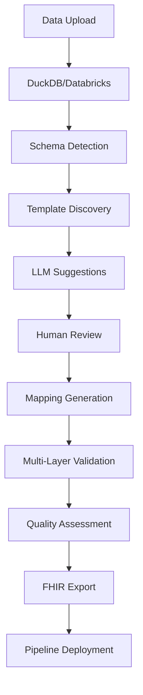

# FhirMapMaster Implementation Plan
## Spec-Driven Development Roadmap

### Executive Summary
This implementation plan transforms FhirMapMaster into an enterprise-grade FHIR mapping platform using spec-driven development principles. The plan addresses your core requirements: LLM-powered mapping, validation/testing frameworks, pipeline integration, database connectivity, and reusable templates.

## Project Structure Overview

```
FhirMapMaster/
├── memory/                    # Project constitution and principles
├── specs/                     # Feature specifications
│   ├── 001-llm-mapping-engine/
│   ├── 002-pipeline-templates/
│   ├── 003-validation-framework/
│   ├── 004-database-integration/
│   └── 005-reusable-templates/
├── templates/                 # Reusable mapping templates
├── scripts/                   # Development and deployment scripts
├── components/               # Existing Streamlit components (enhanced)
├── utils/                    # Enhanced utility modules
└── pipelines/               # YAML pipeline configurations
```

## Implementation Phases

### Phase 1: Foundation & LLM Engine (Weeks 1-4)
**Goal**: Establish spec-driven development foundation and enhance LLM mapping capabilities

#### Week 1-2: Infrastructure Setup
- [ ] Set up spec-kit compatible project structure
- [ ] Enhance existing `llm_service.py` with multi-provider support
- [ ] Implement confidence scoring and suggestion ranking
- [ ] Create LLM prompt optimization framework

**Key Deliverables**:
- Enhanced LLM service supporting OpenAI, Anthropic, Azure OpenAI
- Confidence-scored mapping suggestions
- Caching system for LLM responses
- Cost tracking and optimization

**Integration Points**:
- Extend `utils/llm_service.py` with new architecture
- Enhance `components/mapping_interface_new.py` with confidence scores
- Update `utils/enhanced_mapper.py` with LLM-pattern fusion

#### Week 3-4: Human-in-the-Loop Enhancement
- [ ] Implement interactive review interface improvements
- [ ] Add bulk suggestion acceptance/rejection
- [ ] Create mapping customization tools
- [ ] Build learning system for user preferences

**Key Deliverables**:
- Enhanced mapping interface with suggestion review
- User preference learning system
- Mapping history and rollback capabilities
- Real-time validation feedback

### Phase 2: Validation & Testing Framework (Weeks 5-8)
**Goal**: Implement comprehensive validation and systematic testing

#### Week 5-6: Multi-Layer Validation
- [ ] Integrate HAPI FHIR validator
- [ ] Implement structural and semantic validation
- [ ] Create business rule validation engine
- [ ] Build cross-resource validation system

**Key Deliverables**:
- Multi-validator support (HAPI, Firely, IBM)
- Validation result reporting system
- Business rule definition framework
- Performance-optimized validation pipeline

**Integration Points**:
- Enhance `utils/fhir_validator.py` with multi-engine support
- Update `components/export_interface.py` with validation feedback
- Integrate with existing IG loader system

#### Week 7-8: Testing & Quality Framework
- [ ] Create automated test suite for mappings
- [ ] Implement data quality metrics
- [ ] Build exception detection and reporting
- [ ] Develop performance benchmarking tools

**Key Deliverables**:
- Comprehensive test framework
- Quality metrics dashboard
- Exception reporting system
- Performance monitoring tools

### Phase 3: Database Integration (Weeks 9-12)
**Goal**: Add DuckDB and Databricks support for scalable processing

#### Week 9-10: DuckDB Integration
- [ ] Implement DuckDB connector for local development
- [ ] Create SQL-based transformation engine
- [ ] Add support for multiple file formats
- [ ] Optimize for healthcare data patterns

**Key Deliverables**:
- DuckDB-based local processing engine
- SQL transformation framework
- Multi-format data ingestion
- Local caching and optimization

**Integration Points**:
- Extend `utils/data_processor.py` with DuckDB backend
- Create new `utils/sql_engine.py` module
- Update file upload handling for database integration

#### Week 11-12: Databricks Integration
- [ ] Implement Databricks connector for enterprise scale
- [ ] Create Spark-based transformation pipelines
- [ ] Add Unity Catalog integration
- [ ] Implement streaming data processing

**Key Deliverables**:
- Databricks connector with auto-scaling
- Spark-based FHIR transformations
- Enterprise security integration
- Real-time processing capabilities

### Phase 4: Pipeline & Template System (Weeks 13-16)
**Goal**: YAML-based pipelines and reusable templates

#### Week 13-14: YAML Pipeline Framework
- [ ] Create YAML-based mapping configuration
- [ ] Implement Liquid template engine integration
- [ ] Build CI/CD pipeline support
- [ ] Add automated testing for configurations

**Key Deliverables**:
- YAML configuration schema
- Liquid template processing
- GitHub Actions integration
- Automated deployment pipeline

**Integration Points**:
- New `utils/pipeline_engine.py` module
- YAML configuration loader
- Template processing system
- CI/CD workflow definitions

#### Week 15-16: Reusable Template System
- [ ] Create template library infrastructure
- [ ] Build template discovery and search
- [ ] Implement template customization system
- [ ] Add template quality assurance tools

**Key Deliverables**:
- Template library with versioning
- Template discovery interface
- Customization and inheritance system
- Quality metrics and testing

## Technical Architecture Enhancements

### Enhanced Component Architecture
```python
# New architectural components
utils/
├── llm_service.py           # Multi-provider LLM integration
├── validation_engine.py     # Multi-layer FHIR validation
├── database_adapter.py      # DuckDB/Databricks unified interface
├── pipeline_engine.py       # YAML pipeline processing
├── template_manager.py      # Template library management
└── quality_monitor.py       # Data quality and metrics

components/
├── llm_review_interface.py  # Enhanced human-in-the-loop UI
├── validation_dashboard.py  # Validation results and metrics
├── template_browser.py      # Template discovery and selection
└── pipeline_monitor.py      # Pipeline execution monitoring

pipelines/
├── configurations/          # YAML pipeline definitions
├── templates/              # Liquid transformation templates
└── workflows/              # CI/CD workflow definitions
```

### Data Flow Architecture


## Key Integrations with Existing Code

### 1. LLM Service Enhancement (`utils/llm_service.py`)
```python
# Enhanced LLM service with multi-provider support
class EnhancedLLMService:
    def __init__(self):
        self.providers = {
            'openai': OpenAIProvider(),
            'anthropic': AnthropicProvider(),
            'azure': AzureOpenAIProvider()
        }
        self.cache = LLMResponseCache()
        self.cost_tracker = CostTracker()

    def generate_mapping_suggestions(self, field_context, confidence_threshold=0.7):
        # Multi-provider suggestion generation with confidence scoring
        pass

    def learn_from_feedback(self, suggestions, user_decisions):
        # Update pattern library based on user feedback
        pass
```

### 2. Validation Framework (`utils/fhir_validator.py`)
```python
# Enhanced validation with multiple engines
class MultiValidatorEngine:
    def __init__(self):
        self.validators = {
            'hapi': HAPIValidator(),
            'firely': FirelyValidator(),
            'ibm': IBMValidator()
        }
        self.business_rules = BusinessRuleEngine()

    def validate_resource(self, resource, profile, validation_level='strict'):
        # Multi-level validation with detailed reporting
        pass
```

### 3. Database Integration (`utils/database_adapter.py`)
```python
# Unified database interface
class DatabaseAdapter:
    def detect_environment(self):
        # Auto-detect DuckDB vs Databricks environment
        pass

    def optimize_for_fhir(self, query):
        # Apply platform-specific FHIR optimizations
        pass
```

## Dependencies and Infrastructure

### New Python Dependencies
```yaml
# Additional requirements
dependencies:
  # LLM and AI
  - anthropic>=0.49.0
  - openai>=1.66.0

  # Database engines
  - duckdb>=0.9.0
  - databricks-sql-connector>=2.9.0

  # Validation and testing
  - fhir-r4b>=0.0.1
  - pytest>=7.0.0
  - pytest-cov>=4.0.0

  # Templates and pipelines
  - pyyaml>=6.0
  - jinja2>=3.1.0  # Liquid template alternative
  - gitpython>=3.1.0

  # Performance and monitoring
  - prometheus-client>=0.17.0
  - structlog>=22.0.0
```

### Infrastructure Requirements
```yaml
# Development environment
development:
  - python: ">=3.11"
  - duckdb: "local database"
  - git: "version control"
  - docker: "optional containerization"

# Production environment
production:
  - databricks: "enterprise data platform"
  - github_actions: "CI/CD pipeline"
  - monitoring: "prometheus/grafana"
  - secrets: "environment variables or vault"
```

## Success Metrics & Validation

### Phase 1 Success Criteria
- [ ] LLM suggestion accuracy >75%
- [ ] Processing time reduction >50% vs manual
- [ ] Multi-provider LLM support working
- [ ] User satisfaction >4.5/5

### Phase 2 Success Criteria
- [ ] FHIR validation pass rate >95%
- [ ] Automated test coverage >90%
- [ ] Exception detection rate >99%
- [ ] Validation performance <100ms per resource

### Phase 3 Success Criteria
- [ ] DuckDB processing >50K records/second
- [ ] Databricks auto-scaling functional
- [ ] Cross-platform query compatibility
- [ ] Memory efficiency <2GB for 1M records

### Phase 4 Success Criteria
- [ ] Template adoption >70% of new projects
- [ ] Pipeline deployment time <5 minutes
- [ ] Template consistency >95%
- [ ] YAML configuration coverage 100%

## Risk Mitigation

### Technical Risks
1. **LLM API Costs**: Implement caching and optimize prompts
2. **Databricks Complexity**: Start with DuckDB, gradual migration
3. **Validation Performance**: Use caching and parallel processing
4. **Template Complexity**: Start simple, evolve based on usage

### Organizational Risks
1. **Learning Curve**: Comprehensive documentation and training
2. **Migration from Existing**: Maintain backward compatibility
3. **Resource Allocation**: Phased approach allows resource flexibility

## Next Steps

1. **Week 1 Kickoff**: Review specifications and begin Phase 1 implementation
2. **Stakeholder Review**: Get feedback on specifications before development
3. **Environment Setup**: Prepare development environment with new dependencies
4. **Team Training**: Familiarize team with spec-driven development approach

## Conclusion

This implementation plan transforms FhirMapMaster into a comprehensive, enterprise-grade FHIR mapping platform while maintaining the existing functionality. The spec-driven approach ensures systematic development with clear success criteria and measurable outcomes.

The phased approach allows for iterative delivery and risk mitigation while building towards your vision of an AI-powered, pipeline-ready, template-driven FHIR mapping solution.